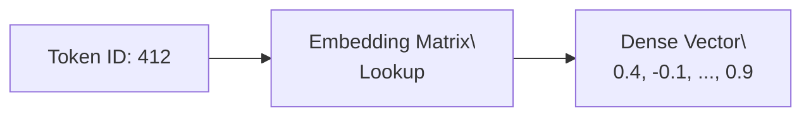
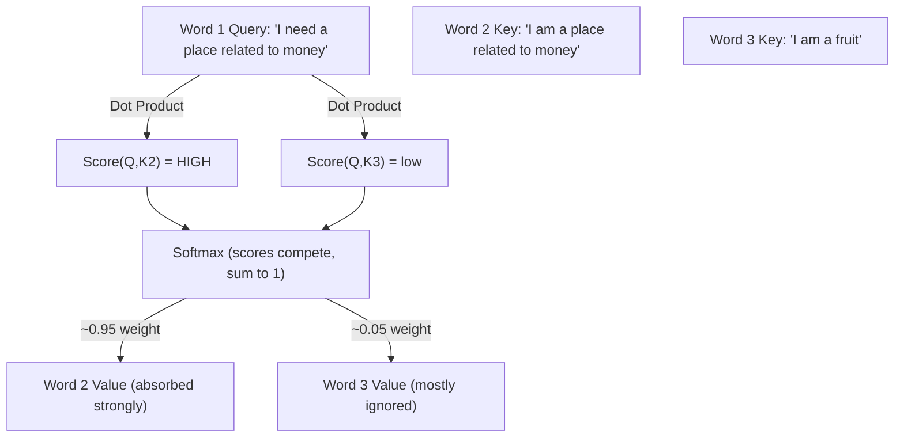

# Chapter 1: Mathematics and Structural Building Blocks

## 1. Tensors & Linear Algebra

### The Underlying Reality of Data
In deep learning, all data (text, images, audio) must be converted into numerical representations called **Tensors**. 

> [!NOTE]
> A Tensor is simply a multi-dimensional array. 
> - **0D Tensor**: A scalar (e.g., `5.0`)
> - **1D Tensor**: A vector (e.g., `[1.0, 2.0]`)
> - **2D Tensor**: A matrix (a table of numbers)
> - **3D+ Tensor**: A cube of numbers (common when dealing with batches of sequences).

**The Analogy:** Think of an Excel spreadsheet. A single cell is a scalar. A single column is a vector. The whole sheet is a matrix. A workbook with multiple sheets is a 3D tensor!

When a Transformer "reads" a sentence, it performs millions of **Dot Products**. A dot product is a mathematical way of measuring how "aligned" two vectors are. If the embedding vector for "King" is mathematically pointed in the same direction as "Queen", their dot product will yield a high number!

> [!NOTE]
> The dot product mixes **both direction *and* magnitude** — two vectors pointing the same way score higher if they are also *longer*. So it is not a pure "similarity" measure (that would be cosine similarity, which divides out the lengths). This is partly why attention later **scales** the scores by $\sqrt{d_k}$ (see Section 4) to keep the magnitudes under control.

### What is a "Parameter"? (The Billion Parameter Question)
You frequently hear about models being "7B" or "70 Billion Parameters." 
A **Parameter** is simply a single, learnable floating-point number living inside one of these `Tensor` matrices (like a weight or a bias). 
When we say a model has 7 Billion parameters, we literally mean there are 7,000,000,000 individual `float16` decimal numbers stored across all of the neural network's Linear/Matrix layers. During training, the optimizer tweaks these exact 7 billion numbers tiny fractions of a percent at a time until they settle into values that capture the statistical regularities of human language!

## 2. Tokenization & Embeddings

### Breaking Apart Language
Before we do math, we must split words up. **Tokenization** breaks a string down into sub-words (tokens). For example, we might *imagine* `"unbelievable"` splitting into clean morphemes like `["un", "believ", "able"]`. This finite vocabulary of chunks (often ~50,000 to ~100,000 unique tokens) allows the model to handle any word ever invented by piecing it together from known fragments.

> [!WARNING]
> **That split is an idealized illustration, not what really happens.** Real tokenizers (like Byte-Pair Encoding, BPE) merge whatever byte-pairs appeared most often in the training data — they do **not** know or respect linguistic morphemes. The actual split is usually messier and counterintuitive, e.g. something like `["un", "bel", "iev", "able"]` or even `["unbeliev", "able"]`, and a leading space is often part of the token. We'll see the real, sometimes surprising splits hands-on in the tokenization notebook.

Each token ID (e.g., `4201`) is a meaningless integer. We use an **Embedding Matrix** to map it into a dense vector space (e.g., a list of 4096 floating-point numbers).

### The Analogy: The City Grid
If words were physical locations, the Embedding Matrix gives them GPS coordinates. As the model trains, "Apple" and "Banana" will be assigned coordinates that explicitly pull them together into the very same neighborhood, far away from the neighborhood holding "Car" and "Truck".

## 3. Positional Encoding (Injecting Time)

### The Flaw of Parallelism
The main feature of Transformers is that they process every word in a sequence *simultaneously* in parallel memory, not one by one like older recurrent models. 
However, this means the model doesn't inherently know that `"The dog bit the man"` is grammatically different from `"The man bit the dog"`. The numbers look identical!

We must inject **Positional Encodings** to give the model a mathematical sense of sequence order. 

**Standard (Sin/Cos) Encodings:** (From the 2017 paper). We add mathematical sine wave frequencies directly to the embeddings. 
**RoPE (Rotary Position Embedding):** (Used in modern models like Llama 3). Instead of *adding* numbers, we *rotate* the vectors radially in the multidimensional space based on their position!

> [!TIP]
> **Why rotating beats adding:** Because attention compares pairs of words via dot products, and rotating both vectors by their positions makes that dot product depend on the *relative* offset between two words (how far apart they are) rather than their absolute slots. That relative-position signal generalizes better to sequence lengths longer than those seen in training (better **extrapolation**), which is why modern models prefer RoPE over simply adding fixed positional vectors.

> [!TIP]
> **The Clock Analogy**: Imagine every word is an hour hand on a clock. The first word is pointing at 12:00. The second word is rotated slightly to 1:00. The model can figure out how far apart two words are sequentially just by measuring the physical angle between their clock hands!

## 4. Attention Mechanisms

### Self-Attention: Understanding Context
Words change meaning based on surrounding words. "Bank" means something different in "River bank" vs "Bank account".

**Self-Attention** allows words to look around the sentence and mix their meanings! 

For every word, we calculate three distinct vectors:
1. **Query (Q)**: What information am I looking for?
2. **Key (K)**: What information do I contain?
3. **Value (V)**: If you pick me, here is my actual content!

Crucially, each Query is compared against **every** Key, and those Keys *compete*. Softmax turns the competing match-scores into percentages that sum to 1, so a strong match for one Key necessarily means less attention for the others:

### Multi-Head Attention (MHA)
Instead of running attention once, we run it multiple times in parallel ("Heads"). 
- Head 1 might focus strictly on grammar (Nouns pointing to verbs).
- Head 2 might focus strictly on sentiment (Happy vs Angry).
- Head 3 might focus strictly on factual entity relationships.

We then **concatenate the heads' outputs and pass them through a final linear (output) projection** — this mixes the per-head results back into a single vector per word. After this step, the word embeddings have become richly context-aware.
