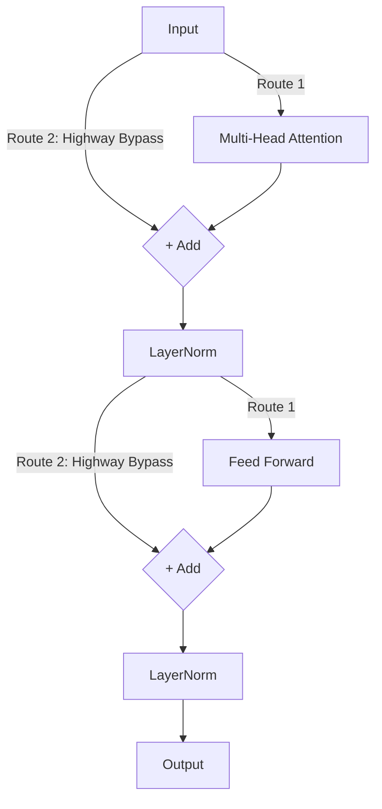

# Chapter 2: Architecture Assembly

With our building blocks (Embeddings, Positional Encodings, and Multi-Head Attention) complete, we need to wire them together into the macro-structures that define a modern Transformer.

## 1. The Encoder Layer (The Reader)

The Encoder's job is strictly to *understand* what the user typed. It processes all tokens synchronously and outputs a deep map of contexts. It does not predict future words. 

### The Components
An Encoder block sequentially passes the data sequentially through internal pipelines:
1. **Self-Attention**: The words talk to each other to understand context (e.g., resolving ambiguity, knowing that "it" refers to the "cat").
2. **Feed-Forward Network (FFN)**: An expansion layer where the vector dimensionality is temporarily blown up by a massive factor (like 4x) and pushed through a non-linear activation function (like ReLU or SwiGLU) before shrinking back down. This is effectively where the model stores world "facts" and performs complex non-linear reasoning.

### Residual Connections & LayerNorm
Deep neural networks suffer from the "Vanishing Gradient Problem," where information mathematically zeroes out as it travels consecutively through 90+ layers.

> [!TIP]
> **The Highway Analogy**: A Residual Connection acts as a high-speed bypass lane. The raw input data is given a dedicated fast lane to literally bypass the Self-Attention block and merge back directly with the output. This guarantees that the original prompt's message is never fully diluted!

**Layer Normalization** smooths out the numerical values so they don't spiral into infinity (NaN divergence errors), forcing the mean of the numbers to 0 and the variance to 1.

## 2. The Decoder Layer (The Writer)

The Decoder's job is autoregressive **generation**. It writes the story word by single word.

### Masked Self-Attention
Because it generates sequentially, the Decoder is strictly forbidden from "looking into the future." If predicting word 4, it can mathematically only look backward at words 1, 2, and 3.

We enforce this using a **Lower Triangular Mask**.
We take the $N \\times N$ attention score matrix and manually overwrite the entire top-right triangle with negative infinity (`-inf`). When passed through a Softmax function, `-inf` becomes precisely `0.0`. 

**The Exam Analogy:** The mask is like placing a piece of dense cardboard over the test answers you haven't written yet. You can only read your past answers!

### Cross-Attention
In the original 2017 Transformer (used exclusively for Sentence-to-Sentence translation), there is a middle layer bridging the physical gap between the Encoder and the Decoder blocks.
- The **Query (Q)** comes natively from the Decoder (e.g., \"I am currently generating a French word, what English concept should I look at?\").
- The **Keys (K) and Values (V)** come wired in directly from the output of the Encoder (The original English sentence!).

## 3. Modern Evolution: Decoder-Only Models

The 2017 Sequence-to-Sequence architecture (Encoder + Decoder) was massively powerful but extremely cumbersome to scale due to the complex cross-communication between blocks. 

Modern foundation models (e.g., **Llama 3, GPT-4, and Claude**) realized one massive truth: *You don't actually need the Encoder!*

### The Decoder-Only Paradigm
If you concatenate the User's prompt and the Assistant's reply into one massive continuous string, you can just use a single stack of homogeneous Decoder layers.

The Decoder reads the prompt (using the standard causality mask, but since the prompt tokens are already completely written out, it natively attends to all of it), and then seamlessly transitions into predicting the next words dynamically. 

This structural deletion saves billions of parameters and drastically simplifies the networking architecture! Thus, today when we say "Large Language Model", we almost exclusively refer to a massive tower consisting purely of Decoder blocks!
