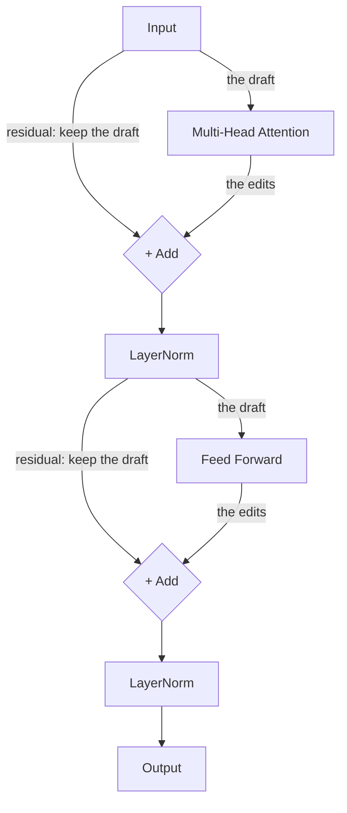

# Chapter 2: Architecture Assembly

With our building blocks (Embeddings, Positional Encodings, and Multi-Head Attention) complete, we need to wire them together into the macro-structures that define a modern Transformer.

> [!IMPORTANT]
> **Why we build the full Encoder–Decoder first.** This chapter and notebooks 10–12 build the *historical* 2017 Encoder–Decoder Transformer, because seeing both halves is the clearest way to learn each component. From the full Transformer (notebook 12) onward we keep **only the Decoder stack** (the Llama-style, decoder-only design used by every modern chat model). **Cross-Attention in particular will be deleted** — learn it for understanding the original architecture, not because the final model uses it.

## 1. The Encoder Layer (The Reader)

The Encoder's job is strictly to *understand* what the user typed. It processes all tokens synchronously and outputs a deep map of contexts. It does not predict future words. 

### The Components
An Encoder block passes the data sequentially through internal pipelines:
1. **Self-Attention**: The words talk to each other to understand context (e.g., resolving ambiguity, knowing that "it" refers to the "cat").
2. **Feed-Forward Network (FFN)**: An expansion layer where the vector dimensionality is temporarily blown up by a massive factor (like 4x) and pushed through a non-linear activation function (like ReLU, GELU, or SwiGLU) before shrinking back down to its original size. Researchers believe this is where much of the model's factual "world knowledge" lives, and it is where the model performs complex non-linear reasoning.

### Residual Connections & LayerNorm
Deep neural networks suffer from the **Vanishing Gradient Problem**: during backpropagation, the *gradient* (the training signal that tells early layers how to improve) shrinks as it is multiplied back layer by layer. This bites long before you reach 90 layers — even a few dozen stacked sublayers can make early layers nearly impossible to train.

> [!TIP]
> **The Editor Analogy** (same as notebook 10): think of your input vector as a *draft*. The sublayer (Attention or FFN) doesn't replace the draft — it proposes a set of *edits*. We compute `out = x + edits`, i.e. we add the edits back onto the original draft. If the edits are bad, the model can learn to ignore them and keep the draft intact. This addition is the "residual connection," and during backpropagation it gives the gradient an uninterrupted highway straight back to the embeddings.

> [!NOTE]
> The residual `x + sublayer(x)` only works if the sublayer's output has the **same dimension** as its input, so the two can be added. That is why `d_model` is preserved everywhere, and why the FFN expands to 4× internally but always shrinks back to `d_model` before the addition.

**Layer Normalization** smooths out the numerical values so they don't spiral into infinity (NaN divergence errors). Standard LayerNorm forces each vector to have mean 0 and variance 1. (Note: modern models often use **RMSNorm** instead, which only rescales magnitude and does *not* center the mean — see notebook 10.)

## 2. The Decoder Layer (The Writer)

The Decoder's job is autoregressive **generation**. It writes the story word by single word.

### Masked Self-Attention
Because it generates sequentially, the Decoder is strictly forbidden from "looking into the future." If predicting word 4, it can mathematically only look backward at words 1, 2, and 3.

We enforce this using a **Lower Triangular Mask**.
We take the $N \\times N$ attention score matrix and manually overwrite the entire top-right triangle with a very large negative number. In code we use `-1e9` (a stand-in for `-inf`, matching the notebooks) rather than a literal `-inf`, which keeps the math numerically stable. When passed through a Softmax function, such a large negative score becomes effectively `0.0`. 

**The Exam Analogy:** The mask is like placing a piece of dense cardboard over the test answers you haven't written yet. You can only read your past answers!

### Cross-Attention
In the original 2017 Transformer (used exclusively for Sentence-to-Sentence translation), there is a middle layer bridging the physical gap between the Encoder and the Decoder blocks.
- The **Query (Q)** comes natively from the Decoder (e.g., \"I am currently generating a French word, what English concept should I look at?\").
- The **Keys (K) and Values (V)** come wired in directly from the output of the Encoder (The original English sentence!).

## 3. Modern Evolution: Decoder-Only Models

The 2017 Sequence-to-Sequence architecture (Encoder + Decoder) was massively powerful but extremely cumbersome to scale due to the complex cross-communication between blocks. 

Modern foundation models (e.g., **Llama 3, GPT-4, and Claude**) realized one massive truth: *You don't actually need the Encoder!*

### The Decoder-Only Paradigm
If you concatenate the User's prompt and the Assistant's reply into one massive continuous string, you can just use a single stack of homogeneous Decoder layers.

The Decoder reads the prompt (using the standard causality mask, but since the prompt tokens are already completely written out, it natively attends to all of it), and then seamlessly transitions into predicting the next words dynamically. 

This structural deletion saves billions of parameters and drastically simplifies the networking architecture! Thus, today when we say "Large Language Model", we almost exclusively refer to a massive tower consisting purely of Decoder blocks!
