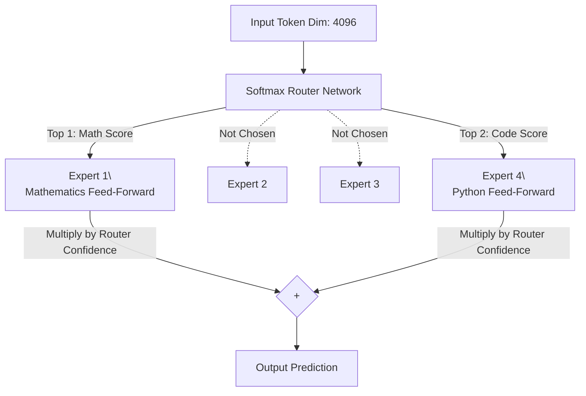

# Chapter 5: Advanced Hardware & Mixture of Experts (MoE)

When you attempt to structurally scale a Transformer up to 70 Billion or natively 1 Trillion parameters, you hit the physical limits of thermodynamics and silicon memory boundaries on the GPU. This chapter conceptually covers the extreme engineering tricks used to push Transformers into the modern State-of-the-Art (SOTA) era.

## 1. Parameter-Efficient Fine-Tuning (PEFT) & LoRA

If you want to dynamically fine-tune a massive 70B parameter model, standard gradient optimization (AdamW) dictates that you must create massive gradient tracking states and continuous momentum variables for every single parameter matrix. Mathematically, this causes training memory to physically blow up to **$4 \\times$ the size of the original model**! You would structurally need massive terabytes of VRAM.

### LoRA (Low-Rank Adaptation)
LoRA conceptually bypasses this entirely:
1. It **Freezes** the massive foundational parameter matrices inside the model. No gradient memory allocation is required for them ever again!
2. It dynamically injects two incredibly tiny "Low-Rank" parameter matrices side-by-side with the frozen matrix.
3. During PyTorch Backpropagation loops, the GPU optimizer is strictly only allowed to iteratively update the floating-point numbers intimately inside the tiny matrices!

**The Dictionary Analogy**: You don't conceptually rewrite an entire dense 5,000-page Encyclopedia identically to natively learn a few new slang words. You cleanly write the new slang concepts onto a highly-compressed subset of tiny sticky notes, and iteratively paste them locally onto the back cover. The heavily dense encyclopedia book stays completely untouched!

## 2. Sparse Mixture of Experts (MoE)

If you want a mathematical model to be theoretically "smarter", you usually structurally make its Dense Feed-Forward layers incrementally wider and distinctly deeper. But a structurally massive model iteratively takes an inherently massive amount of physical time to execute synchronously (Inference Latency). 

**How do we decouple Parameter Count mathematically away from Execution Compute Speed?**

**MoE** natively breaks the single massive structurally Dense layer explicitly into multiple smaller FFN sub-networks called "Experts". 
Instead of a single prompt token statically passing fundamentally through one giant matrix block, a specialized `Softmax Router` network physically grabs the localized token and dynamically shoots it optimally to natively only the Top 2 experts that rigorously specialize in resolving that specific token!

**The Construction Analogy**:
- **Dense Network**: You structurally have one unified "Jack-of-all-Trades" General Contractor worker block. Every single time any dynamic task arises, this one homogenous block manually processes it linearly. Extremely slow constraint.
- **MoE**: You dynamically hire 8 cleanly specialized distinct mathematical workers (The Experts) and rigidly hire 1 structural Foreman (The Router). When a data token arrives, the Foreman instantaneously evaluates it conceptually and physically pipelines to the designated Plumber worker. 7 workers sit functionally idle, organically explicitly saving structural compute block time!

With MoE, a gigantic computational architecture like *Mixtral 8x7B* natively holds roughly definitively 47 Billion foundational parameters physically in memory, but because it is Sparse conceptually, each distinct query token dynamically only ever mathematically passes linearly through 13 Billion localized parameters! This formally achieves the qualitative intelligence capacity logically of a 47B structural model, reliably computing at the physical inference speed synchronously of a fractional 13B model!

## 3. FlashAttention

The final Hardware Memory Wall boundary:
1. **HBM (High Bandwidth Memory)**: Giant GPU spatial memory, but physically incredibly sluggish to sequentially read/write blocks.
2. **SRAM (Static RAM)**: Tiny physical structural chip memory, inherently lightning fast pipeline.

Standard Attention explicitly calculates $Q \\cdot K^T$, structurally walks down to HBM physically to completely save the massive contiguous $N \\times N$ intermediate alignment grid, explicitly walks back up to synchronously read it for Softmax calculations, explicitly walks back implicitly to save it, explicitly walks back physically to synchronously grab it dynamically for the $V$ dot products...
The structural model mathematically sequentially spends 90% of its spatial execution time organically walking to the physical data memory fridge!

### Memory Tiling
FlashAttention rewrites the memory caching physics completely:
It slices the massively contiguous $Q, K,$ and $V$ matrices structurally into tiny structural **Tiles** (Caching Blocks) that perfectly ergonomically physically align and rigidly fit directly natively on the ultra-fast SRAM chip cache.
By natively running a highly structurally optimized continuous mathematical sequential trick dynamically updating the Softmax denominator locally completely natively on the chip continuously without unloading, it iteratively strictly calculates the final contiguous aggregated Output matrix natively without EVER materializing sequentially or structurally explicitly writing the $N \\times N$ intermediate dense attention matrix identically back to the sluggish HBM pool natively!

This physical structural restructuring natively allows architectural Context Windows natively scaling across the entire generative tech world explicitly to sequentially fundamentally skyrocket structurally from a constrained 4,000 dense tokens physically natively up to structurally massive **1,000,000+ localized tokens**! 

***

*Congratulations. You consistently now structurally and mathematically understand fundamentally the deepest logical physical limits, tensor dynamics, training pipelines, and spatial hardware architectures fundamentally driving the entire spectrum of modern Generative Artificial Intelligence today.*
